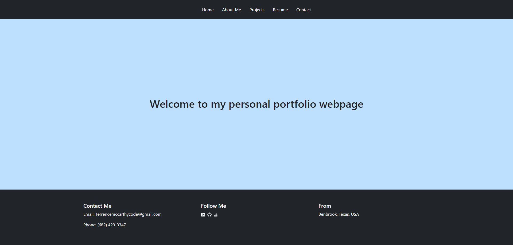

  # reactPortfolio README.md

  ## Description

  This project is a personal portfolio webpage that I have created to use for future jobs

  ## Table Of Contents 

  * [Installation](#Installation)

  * [Usage](#usage)

  * [Contributing](#contributing)

  * [Tests](#tests)

  * [Questions](#questions)

  ## Installation

  To install necessary dependencies, run the following command:

  npm i

  ## Usage

  The use of this project is to have a portfolio that is also a representation of how I can code in react. within this portfolio includes a home, about, projects, resume and contact section.

  ## Contributing 

  no contributions for this projects

  ## Tests

  To run tests run the following command:

  no test

  ## Questions

  if you have any questions about the repo, Please feel free to open a issue or contact me directly at terrencemccarthycode@gmail.com
  You can find more of my work at https://github.com/Tmysterz

  ## Screenshot 

  

  ## Deployed application

  [reactPortfolio]()